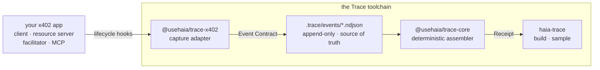

# Haia Trace

Local-first **Operation Receipts** for agentic payments. Trace passively records
the lifecycle of a payment operation and assembles a single verdict — what
completed, what's missing, and which faults were observed — entirely on your
machine, with no registration.

A Receipt is **not a log** (it interprets events into a verdict), **not a
merchant receipt** (it's built from your own observations, so it holds up in a
dispute), and **not a dashboard** (it's the full account of one operation, not
trends across many).

## Try it in 60 seconds

No install needed — run the bundled sample through the real assembler:

```sh
npx @usehaia/trace-cli sample x402-payment
```

You'll see three operations from one fixture run: a **FULL** receipt, a
**PARTIAL** one with an explained gap, and one with an observed fault — the
product's whole spectrum, assembled by the same deterministic core a live run
uses.

## Packages

| Package                                        | Role                                                            |
| ---------------------------------------------- | --------------------------------------------------------------- |
| [`@usehaia/trace-core`](./packages/core)       | Contracts (Event / Template / Receipt) and the receipt assembler. |
| [`@usehaia/trace-x402`](./packages/x402)       | Capture adapter for the x402 payment SDK — records lifecycle events. |
| [`@usehaia/trace-cli`](./packages/cli)         | The `haia-trace` command-line tool and renderers.               |

`trace-x402` and `trace-cli` depend on `trace-core`. Each package has its own
README with full usage.

## Install

```sh
# The CLI — installs the `haia-trace` command
npm install -g @usehaia/trace-cli      # or run ad hoc with `npx @usehaia/trace-cli`

# The x402 capture adapter — add to the app whose payments you want to record
npm install @usehaia/trace-x402
```

## How it fits together



Events are the source of truth; a Receipt is derived and reproducible — the same
NDJSON always assembles to the same Receipt.

## Status

Early and pre-1.0. What's wired today:

- **`trace-core`** — the Event / Template / Receipt contracts and the
  deterministic assembler are complete.
- **`trace-cli`** — `sample`, `build`, and `templates` all work. `build`
  assembles receipts from a `.trace/events/*.ndjson` run file.
- **`trace-x402`** — attaches to the x402 v2 lifecycle hooks and records each
  firing, strictly passively, as a normalized and redacted event. Point it at
  `.trace/events` and `trace(...)` → `haia-trace build` produces a receipt per
  payment. One gap remains: the shipped template's `paid_action` stage is closed
  by a business event the adapter does not observe, so even a clean payment
  assembles as `partial` today. See its [README](./packages/x402).

## Develop from source

Requires **Node ≥ 20** and **pnpm**.

```sh
pnpm install
pnpm build         # compile all packages (topological: core first)
pnpm test          # build, then run the suite
pnpm check-types   # build, then tsc --noEmit
```

`pnpm test` and `pnpm check-types` build first automatically, so they work on a
fresh checkout. See [CLAUDE.md](./CLAUDE.md) for engineering conventions.

## License

[MIT](./LICENSE)
