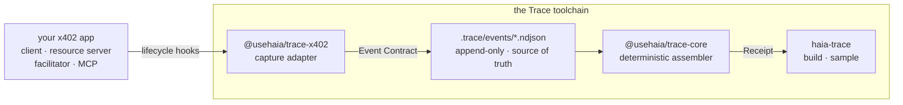

# Haia Trace

[](https://github.com/Haia-Finance/haia-trace/actions/workflows/ci.yml)
[](https://www.npmjs.com/package/@usehaia/trace-cli)
[](https://nodejs.org)
[](https://www.typescriptlang.org)
[](./LICENSE)

Local-first **Operation Receipts** for agentic payments. Trace passively records
the lifecycle of a payment operation and assembles a single verdict — what
completed, what's missing, and which faults were observed — entirely on your
machine, with no registration.

A Receipt is **not a log** (it interprets events into a verdict), **not a
merchant receipt** (it's built from your own observations, so it holds up in a
dispute), and **not a dashboard** (it's the full account of one operation, not
trends across many).

## Try it in 60 seconds

No install needed — run the bundled sample through the real assembler:

```sh
npx @usehaia/trace-cli sample x402-buyer        # the paying agent's view
npx @usehaia/trace-cli sample x402-seller       # the resource server's view
npx @usehaia/trace-cli sample x402-facilitator  # the verify/settle service's view
```

You'll see three operations from one fixture run: a **FULL** receipt, a
**PARTIAL** one with an explained gap, and one with an observed fault — the
product's whole spectrum, assembled by the same deterministic core a live run
uses.

## Then on a real agent

[`examples/x402-agent`](./examples/x402-agent) is a buyer agent built on the
actual `@x402/core` client, traced by one line and assembled into receipts:

```sh
cd examples/x402-agent
pnpm demo     # the agent pays twice, then the receipts are built
pnpm policy   # the agent reads the verdict and stops on the unresolved one
```

Only the buyer is instrumented, because that is all you own: the sellers are
other people's services. The money is simulated — there is no chain and no
facilitator — and the README says exactly which parts are real.

## Packages

| Package                                  | Version                                                                                                              | Role                                                                 |
| ---------------------------------------- | -------------------------------------------------------------------------------------------------------------------- | -------------------------------------------------------------------- |
| [`@usehaia/trace-core`](./packages/core) | [](https://www.npmjs.com/package/@usehaia/trace-core) | Contracts (Event / Template / Receipt) and the receipt assembler.    |
| [`@usehaia/trace-x402`](./packages/x402) | [](https://www.npmjs.com/package/@usehaia/trace-x402) | Capture adapter for the x402 payment SDK — records lifecycle events. |
| [`@usehaia/trace-cli`](./packages/cli)   | [](https://www.npmjs.com/package/@usehaia/trace-cli)   | The `haia-trace` command-line tool and renderers.                    |

`trace-x402` and `trace-cli` depend on `trace-core`. Each package has its own
README with full usage.

## Install

```sh
# The CLI — installs the `haia-trace` command
npm install -g @usehaia/trace-cli      # or run ad hoc with `npx @usehaia/trace-cli`

# The x402 capture adapter — add to the app whose payments you want to record
npm install @usehaia/trace-x402
```

## How it fits together



Events are the source of truth; a Receipt is derived and reproducible — the same
NDJSON always assembles to the same Receipt.

## Status

Early and pre-1.0. What's wired today:

- **`trace-core`** — the Event / Template / Receipt contracts and the
  deterministic assembler are complete.
- **`trace-cli`** — `sample`, `build`, and `template` all work. `build`
  assembles receipts from a `.trace/events/*.ndjson` run file, against a built-in
  template or one you scaffold with `haia-trace template new`. `--dir` moves the
  whole `.trace/` root; the layout inside it stays fixed.
- **`trace-x402`** — attaches to the x402 v2 lifecycle hooks and records each
  firing, strictly passively, as a normalized and redacted event. Point it at
  `.trace/events` and `trace(...)` → `haia-trace build` produces a receipt per
  payment, assembled with the per-role `x402-buyer` / `x402-seller` /
  `x402-facilitator` templates — a clean payment assembles as `full`. See its
  [README](./packages/x402).

## Develop from source

Requires **Node ≥ 22** and **pnpm**.

```sh
pnpm install
pnpm build         # compile all packages (topological: core first)
pnpm test          # build, then run the suite
pnpm check-types   # build, then tsc --noEmit
```

`pnpm test` and `pnpm check-types` build first automatically, so they work on a
fresh checkout. See [CLAUDE.md](./CLAUDE.md) for engineering conventions.

## License

[MIT](./LICENSE)
