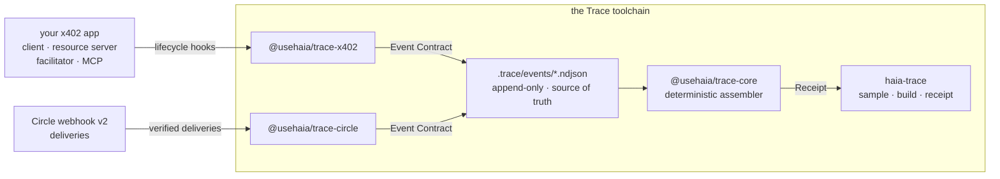

# Haia Trace

[](https://github.com/Haia-Finance/haia-trace/actions/workflows/ci.yml)
[](https://www.npmjs.com/package/@usehaia/trace-cli)
[](https://nodejs.org)
[](https://www.typescriptlang.org)
[](./LICENSE)

Local-first **Operation Receipts** for agentic payments. Trace passively records
the lifecycle of a payment operation and assembles a single verdict — what
completed, what's missing, and which faults were observed — entirely on your
machine, with no registration.

A Receipt is **not a log** (it interprets events into a verdict), **not a
merchant receipt** (it's built from your own observations, so it holds up in a
dispute), and **not a dashboard** (it's the full account of one operation, not
trends across many).

Docs: [developers.haia.finance](https://developers.haia.finance).

## Try it in 60 seconds

No install needed — replay a bundled fixture run through the real assembler:

```sh
npx @usehaia/trace-cli sample              # an x402 payment, as the paying client saw it
npx @usehaia/trace-cli sample escrow-arc   # an escrow on Arc, agreement to release or refund
npx @usehaia/trace-cli template list       # every template you can build against
```

Each x402 fixture set holds three operations: a **FULL** receipt, a **PARTIAL**
one with an explained gap, and one carrying an observed fault. The escrow set
holds four, because an escrow resolves two ways — released or refunded, both
**FULL**. Same deterministic core a live run uses; only the events come from a
file instead of a recorder.

## Then on a real agent

[`examples/x402-agent`](./examples/x402-agent) is a buyer agent built on the
actual `@x402/core` client, traced by one line and assembled into receipts:

```sh
cd examples/x402-agent
pnpm demo     # the agent pays twice, then the receipts are built
pnpm policy   # the agent reads the verdicts and stops on the unresolved one
```

Only the buyer is instrumented, because that is all you own: the sellers are
other people's services. The money is simulated — there is no chain and no
facilitator — and [its README](./examples/x402-agent) says exactly which parts
are real.

## Packages

| Package                                      | Version                                                                                                                              | Role                                                                 |
| -------------------------------------------- | ------------------------------------------------------------------------------------------------------------------------------------ | -------------------------------------------------------------------- |
| [`@usehaia/trace-core`](./packages/core)     | [](https://www.npmjs.com/package/@usehaia/trace-core)     | Contracts (Event / Template / Receipt) and the receipt assembler.    |
| [`@usehaia/trace-x402`](./packages/x402)     | [](https://www.npmjs.com/package/@usehaia/trace-x402)     | Capture adapter for the x402 payment SDK — records lifecycle hooks.  |
| [`@usehaia/trace-circle`](./packages/circle) | [](https://www.npmjs.com/package/@usehaia/trace-circle) | Capture adapter for Circle webhook v2 notifications.                 |
| [`@usehaia/trace-cli`](./packages/cli)       | [](https://www.npmjs.com/package/@usehaia/trace-cli)       | The `haia-trace` command-line tool and renderers.                    |

Both adapters and the CLI depend on `trace-core`. Each package README gets you
running; the full reference lives at
[developers.haia.finance](https://developers.haia.finance).

## Install

```sh
# The CLI — installs the `haia-trace` command
npm install -g @usehaia/trace-cli      # or run ad hoc with `npx @usehaia/trace-cli`

# A capture adapter — add to the app whose payments you want to record
npm install @usehaia/trace-x402        # in-process, for the x402 payment SDK
npm install @usehaia/trace-circle      # in a webhook route, for Circle notifications
```

## How it fits together



Events are the source of truth; a Receipt is derived and reproducible — the same
NDJSON always assembles to the same Receipt. A **template** says which milestones
an operation is expected to hit; four ship with the CLI (`x402-buyer`,
`x402-seller`, `x402-facilitator`, `escrow-arc`) and `haia-trace template new`
scaffolds your own.

## Maturity

Pre-1.0, published and usable. The contracts, the assembler, both adapters and
every CLI command work today, and the packages are versioned together. Expect
the contracts to still move before 1.0 — pin an exact version if a receipt has
to keep assembling identically.

## Develop from source

Requires **Node ≥ 22** and **pnpm**.

```sh
pnpm install
pnpm build         # compile all packages (topological: core first)
pnpm test          # build, then run the suite
pnpm check-types   # build, then tsc --noEmit
```

`pnpm test` and `pnpm check-types` build first automatically, so they work on a
fresh checkout. See [CLAUDE.md](./CLAUDE.md) for engineering conventions and
[docs/README.md](./docs/README.md) for the documentation site.

## License

[MIT](./LICENSE)
