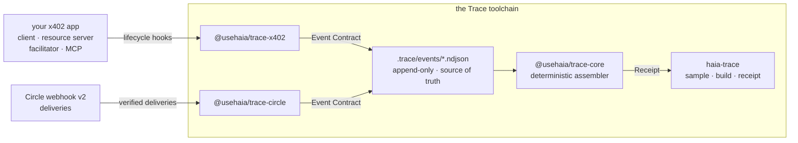

**Haia Trace** passively records the lifecycle of a payment operation and
assembles a single verdict — what completed, what's missing, and which faults
were observed — entirely on your machine, with no registration.

The one artifact is the **Operation Receipt**. It is:

<CardGroup cols={3}>
  <Card title="Not a log" icon="list">
    A log shows events. A Receipt interprets them — comparing the operation's
    expected flow against what was actually observed and stating a verdict.
  </Card>
  <Card title="Not a merchant receipt" icon="receipt">
    A merchant issues its own receipt. A Trace Receipt is built from *your*
    observations, so it holds up in a dispute with that merchant.
  </Card>
  <Card title="Not a dashboard" icon="chart-line">
    Not trends across many operations — the full, evidence-backed account of
    one.
  </Card>
</CardGroup>

## How it fits together

An adapter records what it observed. A **template** says which milestones the
operation was expected to hit. The assembler folds the two into a Receipt.
Events are the source of truth and the Receipt is derived — the same NDJSON
always assembles to the same Receipt.

## Start here

<CardGroup cols={3}>
  <Card title="Quickstart" icon="play" href="/quickstart">
    One command, no install, a Receipt on screen.
  </Card>
  <Card title="What a Receipt is" icon="receipt" href="/concepts/operation-receipt">
    Stages, evidence, missing, exceptions — the model behind the verdict.
  </Card>
  <Card title="Demo" icon="robot" href="/demo">
    A real agent pays twice, reads its own verdict, and stops spending.
  </Card>
</CardGroup>

## The packages

<CardGroup cols={2}>
  <Card title="@usehaia/trace-cli" icon="terminal" href="/cli/overview">
    The `haia-trace` command — assembles and renders receipts.
  </Card>
  <Card title="@usehaia/trace-x402" icon="plug" href="/sdk/x402">
    Capture adapter for the x402 payment SDK.
  </Card>
  <Card title="@usehaia/trace-circle" icon="webhook" href="/sdk/circle">
    Capture adapter for Circle webhook v2 notifications.
  </Card>
  <Card title="@usehaia/trace-core" icon="cube" href="/sdk/core">
    Contracts and the deterministic receipt assembler.
  </Card>
</CardGroup>

<Note>
  Haia Trace is pre-1.0. All four packages are published and versioned together;
  expect the contracts to still move before 1.0. Pin an exact version if a
  receipt has to keep assembling identically.
</Note>
