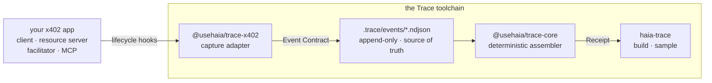

**Haia Trace** passively records the lifecycle of a payment operation and
assembles a single verdict — what completed, what's missing, and which faults
were observed — entirely on your machine, with no registration.

The one artifact is the **Operation Receipt**. It is:

<CardGroup cols={3}>
  <Card title="Not a log" icon="list">
    A log shows events. A Receipt interprets them — comparing the operation's
    expected flow against what was actually observed and stating a verdict.
  </Card>
  <Card title="Not a merchant receipt" icon="receipt">
    A merchant issues its own receipt. A Trace Receipt is built from *your*
    observations, so it holds up in a dispute with that merchant.
  </Card>
  <Card title="Not a dashboard" icon="chart-line">
    Not trends across many operations — the full, evidence-backed account of
    one.
  </Card>
</CardGroup>

## How it fits together

Events are the source of truth; a Receipt is derived and reproducible — the same
NDJSON always assembles to the same Receipt.

## The packages

<CardGroup cols={3}>
  <Card title="@usehaia/trace-cli" icon="terminal" href="/cli/overview">
    The `haia-trace` command — assembles and renders receipts.
  </Card>
  <Card title="@usehaia/trace-x402" icon="plug" href="/sdk/x402">
    Capture adapter for the x402 payment SDK.
  </Card>
  <Card title="@usehaia/trace-core" icon="cube" href="/sdk/core">
    Contracts and the deterministic receipt assembler.
  </Card>
</CardGroup>

<Note>
  Haia Trace is pre-1.0. The `trace-core` contracts and assembler and the
  `haia-trace` CLI (`sample`, `build`, `templates`) are in place, and the
  `trace-x402` adapter records the x402 lifecycle hooks passively as normalized,
  redacted events into `.trace/events`. Receipts assemble against the per-role
  `x402-buyer` / `x402-seller` templates — a clean payment assembles as `full`.
  See [Connect x402](/sdk/x402).
</Note>

Ready to see a Receipt? Head to the [Quickstart](/quickstart).
